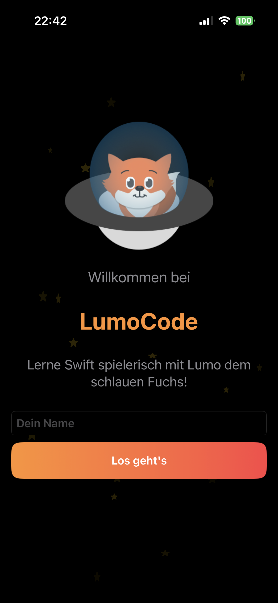
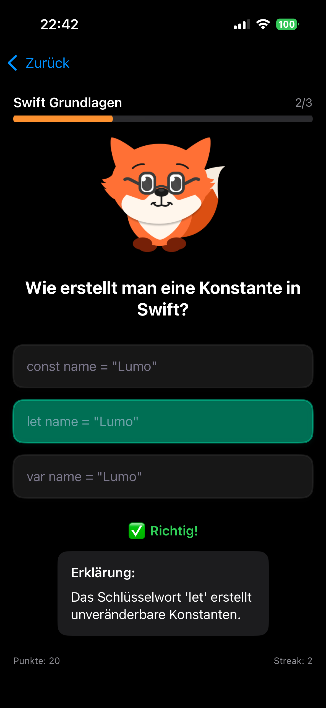
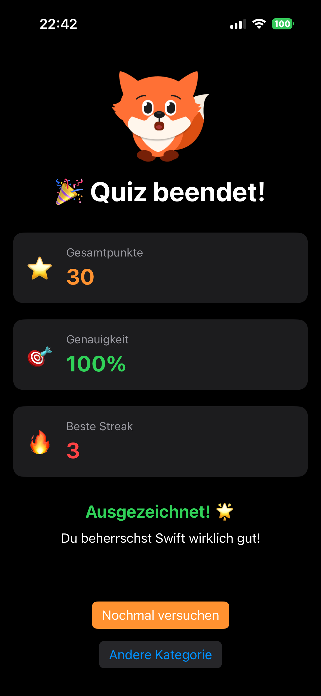

# LumoCode

**LumoCode** ist eine gamifizierte Lern-App für Swift-Programmierung. Durch Quizfragen, das motivierende Lumo-Maskottchen und sofortiges Feedback vermittelt die App Lerninhalte spielerisch und intuitiv.

---

## Features
- Drei thematische Quiz-Kategorien  
- Spielerische Punkte, Streaks und visuelles Feedback  
- Responsive, barrierefreie Benutzeroberfläche  
- Personalisierte Nutzererfahrung  
- Modularer Aufbau für zukünftige Erweiterungen  

---

## Screenshots

### Willkommens-Screen
  
Lumo-Maskottchen, Eingabefeld für Namen, „Los geht’s!“-Button.

### Kategorie-Auswahl
  
2x2 Grid mit Kategorien, Icons, Fragenanzahl, personalisierte Begrüßung.

### Quiz-Ansicht
  
Fortschrittsbalken, Frage im Zentrum, drei Antwortoptionen als Buttons.

### Feedback-Zustand
  
Farbige Markierung der Antwort, Lumo-Animation, Erklärungstext.

### Ergebnis-Screen
  
Punkte, Genauigkeit, beste Streak, Buttons zum Wiederholen oder Kategoriewechsel.

---

## Bedienungsbeispiel (Use Case)
1. App starten → Willkommens-Screen  
2. Name eingeben → „Los geht’s!“ tippen  
3. Kategorie auswählen → Quiz startet automatisch  
4. Fragen beantworten → Sofortiges Feedback erhalten  
5. Quiz abschließen → Ergebnis-Screen mit Auswertung  

---

## Installation
1. Repository von GitHub klonen:  
   ```bash
   git clone [<REPOSITORY-URL>](https://github.com/iosif-gogolos/LumoCode/)
   ```
2. Projekt in Xcode 16 öffnen

3. Auf einem iOS-Gerät oder Simulator bauen und ausführen

--- 
## Validierung

- Name muss eingegeben werden, bevor der Quiz-Flow gestartet wird

- Antwort-Buttons reagieren nur auf gültige Auswahl

---
## Evaluation & Benutzerfeedback

### Positive Rückmeldungen:

- Intuitive Navigation ohne Einführung
- Lumo-Maskottchen motivierend und sympathisch
- Sofortiges Feedback verhindert Frustration

## Verbesserungsvorschläge:
- Ausführlichere Erklärungen bei komplexen Themen
- Wiederholbarkeit bereits beantworteter Fragen
- Soundeffekte zur Verstärkung
- Fortschrittsanzeige über mehrere Sessions

---
## Ausblick

### Kurzfristig (Version 1.1):
- Mehr Fragen pro Kategorie
- Core Data für lokale Fortschrittsspeicherung
- Zusätzliche Swift-Themen

### Mittelfristig (Version 2.0):
- Backend-Integration mit REST-API
- Benutzerkonten und Cloud-Synchronisation
- Adaptive Schwierigkeitsgrade

### Langfristig (Version 3.0+):
- Multi-Language Support (Python, JavaScript, Java)
- Community-Features (Leaderboards, Challenges)
- AI-basierte personalisierte Lernpfade

---

## Lizenz

Dieses Projekt ist unter der MIT-Lizenz lizenziert.

Hinweis: Das Projekt kann direkt aus GitHub heruntergeladen, in Xcode 16 geöffnet, gebaut und auf einem iOS-Gerät ausgeführt werden.
